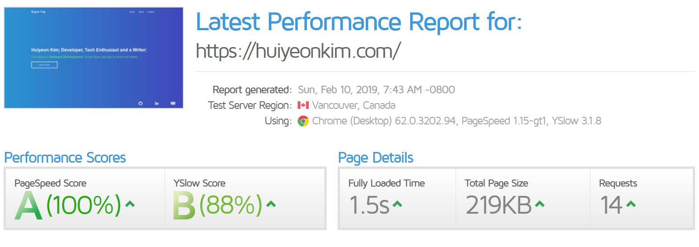

In this article, Im going to tell you about how I completely upgraded my portfolio using JavaScript Static Generator called [Gatsby.js](https://www.gatsbyjs.org/) and a few other libraries. If you are considering about making a Website powered by the amazing React.js but still want the speed of a lightning strike, you should definitely consider using Gatsby.js. This blog itself was built on Gatsby.

My Portfolio: [Click Here](https://huiyeonkim.com).
Source Code for Portfolio: [Click Here](https://github.com/huiyeon5/huiyeon5.github.io)

This article is not really technical, there isnt much code involved.

## Why I wanted to upgrade my Portfolio website.

There were a few reasons why I wanted to change and redesign my personal portfolio website:

<br/>


<br/>
<br/>

1. Speed: My website's load time and performance was unbelievably, **painfully**, utterly miserable. It took ages to load the content. (You can see from the above image..)
2. Design: My landing page was just too dark and portrayed a negative image for me (I have no clue why I decided it looked good)
3. Responsiveness: My website was sort of responsive but not 100%. It looked pretty okay on Firefox Desktop/Mobile, Google Chrome Desktop/Mobile, but was broken on Safari. 

My personal portfolio website was the first Front End project Ive undertaken, just using HTML/CSS/Javascript. Maybe that was the reason it was not as up to par as the other portfolio websites on the web. The goal was: Increase speed and improve the design.

## Gatsby.js - Hands down the best and my favorite technology to use.

I first came across Gatsby.js two months ago when I wanted to start my own blog. Searching up on what technology people use to create a blog, I came across articles talking about React.js & Gatsby.js. As I had a few projects down with React, I was pretty comfortable using the technology but Gatsby, it was completely new to me. In fact, I was not completely familiar with the concept of Static Site Generators. But I decided to take a jab at it as it was holiday time for me and I pretty much had nothing better to do.

Working on my blog and the portfolio, I fell DEEPLY in love with Gatsby.js. It completely bought me over. Let me share a few reasons why.

### 1. Powered by React.js/GraphQL/Webpack.
One of the main reason why I was completely bought over was the fact it was powered by **React.js**. I love React, the component-based development, state management and all that jazz. Gatsby completely incorporated React into their stack, making it much easier for me to develop. Shoutout to *Gatsby Link* for making routing of pages SUPER easy.

GraphQL was a "Heard before, never used" kind of technology to me. I took a while learning about the basics of GraphQL from YouTube (*Shoutout to* [Net Ninja](https://www.youtube.com/channel/UCW5YeuERMmlnqo4oq8vwUpg) for the tutorial) and it was great. The flexibility to form queries from the client side, without worrying about the implementation at the backend is really amazing. 

And finally, Webpack. I have a love and hate relationship with webpack. I love what it does for me but I hate configuring it. Gatsby took care of the configuration for me which was awesome (they do now how to make me love it).

### 2. Gatsby Image.

When I was first making my portfolio, I really struggled with making my images responsive and I hated it the fact that it took so long to load. Seeing the blank white space for the image was very disturbing. Again, Gatsby provides an amazing solution to this which is Gatsby Image.

With a simple GraphQL query string like:

```
query ImageQuery {
  allFile {
    edges {
      node {
        childImageSharp {
          fluid(maxWidth:2600) {
            ...GatsbyImageSharpFluid
            originalName
          }
        }
      }
    }
  }
}
```
IT would generate an image set which is FULLY responsive and allows lazing-loading/blur effect while loading the image. WONDERFUL. It was mindblowing to me how simple it was to create fully responsive image with the blur effect. The image returned from this query can be used by rendering the `fluid` object using a `Img` component, provided by Gatsby-Image:

``

And voila! The image can be shown now!

### 3. Gatsby Plugins.
Gatsby provides HUNDREDs of plugins for us to use, from Markdown Processors to Google Analytics plugin, you name it, they most probably will have it. It was a breeze to make websites interactive and powerful using the plugins. Generating Sitemaps for SEO purposes, Robots.txt, using google fonts and analytics,  everything was super easy with the plugins they provided.

### 4. Hosting on Netlify.

Gatsby compiles ALL your CSS and JS files into the `public` folder as a static page. As your web app is technically a static page, the hosting is already quite easy, you can choose to host anywhere. My previous version of the portfolio was hosted on Github Pages but I decided to take Netlify as an option. 

With Netlify, hosting your Gatsby-powered Website more than just easy. Their free-tier, which Im currently using, itself was amazing. Connecting to your GitHub repository, all it took was a few clicks to deploy the website. It also provides Continuous Deployment (Amazing) by automatically building from the newest commit to the Github Repository and serving the new Static pages from that build. It only took a few clicks and very simple configuration to achieve that.

## The Results.


<br/>



<br/>
<br/>

As you can see from the above image, the results were great. Lightning fast speed, Lazy-loading images and a good SEO score. 

Of course, it took more than just Gatsby to make the website look better. [React-Reveal](https://www.react-reveal.com/) and [React-Spring](https://react-spring.surge.sh/) was heavily used to create the animations on the website. It definitely added some spice to it. [Materialize CSS](https://materializecss.com/) is also something I used on my website to help me easily handle the Responsiveness of the website. If not for all these technologies, my website would not look remotely close to how it does now.

It was definitely a fun experience to use Gatsby.js and I would definitely use it for my next project. By rebuilding my website using Gatsby, I was able to learn a new technology (Obviously), practice my React.js skills, finally learn GraphQL and also picked up a few more libraries along the way. Also, learning how to use Netlify, their redirects rule, continuous deployment, was an awesome experience.

If anyone wants to make a website, check out Gatsby.js. It really is amazing.