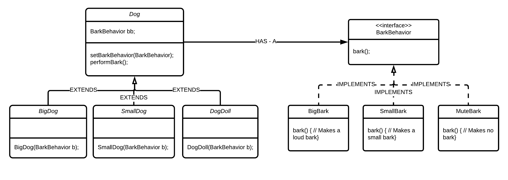

Today I'm going to talk to you about what I learnt most recently. The topic was brought up during a small talk session with one of a technical lead of a bank. After the talk, I decided to take up learning about Design Patterns and how I can prevent myself from writing spaghetti code and learning about the best practices while designing software. (Honestly I am always terrified about the fact that my code might be too messy.. Hopefully learning about some Design Patterns could help me a little at least).

I just started reading the [Head First Design Patterns](http://shop.oreilly.com/product/9780596007126.do) book and honestly the book is so interesting and funny that its hard to stop once you start. The way it was written really did help me learn the concept easier. Maybe I could write about the whole book once I'm done with it.

## Strategy Pattern

The definition of Strategy Pattern provided by the book is:

> The Strategy Pattern defines a family of algorithms,
encapsulates each one, and makes them interchangeable. Strategy
lets the algorithm vary independently from clients that use it.
--- Page 67, [Head First Design Patterns](http://shop.oreilly.com/product/9780596007126.do) ---

Lets take a look at a simple example to really understand what a Strategy Pattern is.

For example, lets take a look at the Dog class below:

    public class Dog {
        // instance variables here
        public Dog() {
            //set instance here
        }
        
        public void bark() {
            System.out.println("Bark Bark");
        }
    }

This is a very simple Dog class where the only action a Dog can do is to bark. 

Now lets bring in some child classes of Dog to make it more interesting. Eg: SmallDog, BigDog and a DogDoll.

    public class SmallDog extends Dog {
        // other methods here
    }

    public class BigDog extends Dog {
        // other methods here
    }
    
    public class DogDoll extends Dog {
        // other methods here
    }

In this case, no matter what kind of dog it is, the bark is the same for all classes as the method is implemented at the super class level. Even if the Dog is a Doll (Assuming its not some high tech doll which can actually bark) the bark() method would still run on a DogDoll object. How do we prevent this from happening and have different implementations for different dogs?

#### Solution: 1 - Abstract Class (Good but not great solution)
We can solve this problem partially by using an Abstract class of Dog where the bark function is implemented at the child class level.

    public abstract class Dog {
    
        // same as before
        
        public abstract void bark();
    }
    
    // ------------------- Child Classes ---------------
    
    public class SmallDog extends Dog {
        public void bark() {
            System.out.println("bark bark");
        }
    }

    public class BigDog extends Dog {
        public void bark() {
            System.out.println("BARK BARK BARK BARK");
        }
    }
    
    public class DogDoll extends Dog {
        public void bark() {
            System.out.println("... Silence ...");
        }
    }

As you can see in the code example above, with the use of Abstract class, we were able to provide different implementation of bark to different Child Classes of the Dog class. We would be able to call the bark method in this way:

    public class DogSimulator {
        public static void main(String[] args) {
            Dog bigDog = new BigDog();
            Dog smallDog = new SmallDog();
            bigDog.bark();
            smallDog.bark();
        }
    }

All is good and fine.. But it gives rise to 3 questions.
1. What would happen if we need to add a few more classes of Dogs which has different or same implementations of the Bark as the ones we already have? 
2. What happens if we want to know all the different kinds of Bark implementation the system has? 
3. What happens if we want to change the kind of bark a Dog can make?

With the current structure, it would definitely be a problem. With an addition of another kind of Dog, we would have to implement the bark() method in that class, even if it has the same bark as BigDog or SmallDog. How should we solve this?

#### Solution 2 - Define Interface/Abstract Class for different Barks.

We can solve it by having an Interface called BarkBehavior which defines the bark method.  This means that we would be removing the method Bark from the Dog class due to its varying nature. This is the first design principle!

> Whatever varies in your program, separate it from what doesnt vary. Encapsulate it.

This means that, we encapsulate the thing which varies in a class into another Interface or Abstract class to completely isolate the varying implementations of it.

    public interface BarkBehavior {
        public void bark();
    }

Different implementations of Bark would be a separate class which implements the BarkBehavior interface. 

    public class BigBark implements BarkBehavior {
        public void bark() {
	        System.out.println("BARK BARK BARK BARK");
        }
    }
    
    public class SmallBark implements BarkBehavior {
        public void bark() {
            System.out.println("bark bark");
        }
    }
    
    public class MuteBark implements BarkBehavior {
        public void bark() {
            System.out.println("... Silence ...");
        }
    }

Now how do we link these behavior to the Dog class? We can first remove the bark() method and add in an Instance Variable of BarkBehavior, with a Setter method for BarkBehavior.

    public class Dog {
        BarkBehavior bb;
           
        public void setBarkBehavior(BarkBehavior bb) {
            this.bb = bb;
        }
        
        public void performBark() {
            bb.bark();
        }
    }

We are making use of Composition to handle the Bark method instead of Inheritance. Now Dog has a **HAS-A** relationship with BarkBehavior, which always should be preferred over Inheritance. And hence Design Principle 2.

> Always prefer Composition over Inheritance

Now we change the different types of Dog to be:

    public class SmallDog extends Dog {
        public SmallDog(BarkBehavior b) {
            bb = b;
        }
    }

    public class BigDog extends Dog {
        public BigDog(BarkBehavior b) {
            bb = b;
        }
    }
    
    public class DogDoll extends Dog {
        public DogDoll(BarkBehavior b) {
            bb = b;
        }
    }

With this, we would be able to pass in the Behavior when we write our main method! The reason for using a Constructor to set the behavior AS WELL AS the setter method is to allow the client to change the Behavior whenever he/she wants. The constructor behavior would be like *default* BarkBehavior but BarkBehavior can change over time. So by using the setter method, we can change the behavior any time!!!!!

    public class DogSimulator {
        public static void main(String[] args) {
            Dog bigDog = new BigDog(new BigBark());
            Dog smallDog = new SmallDog(new SmallBark());
            bigDog.performBark();
            smallDog.performBark();

            bigDog.setBarkBehavior(new SmallBark());
            bigDog.performBark();
        }
    }

This would provide maximum flexibility, Code reuse and non spaghetti code!!

The benefits of this program would be:

1. We can add Different types of Dog, without the need of implementing another version of Bark if it has the same bark as before.
2. We can easily know the different types of Bark available as we grouped the Algorithms (BarkBehavior) together.
3. We can easily change the BarkBehavior while runtime, without changing the actual implementation of the Dog Subclasses.
4. Implementing new BarkBehaviors or Dog Subclass will not have any affect on the previous implementations. The previous ones will work just fine even if we add more.

And THIS is called Strategy Pattern. The below is how the Class Diagram would look like.

I hope this was easy to understand and keep checking learnwars.com to read more articles!