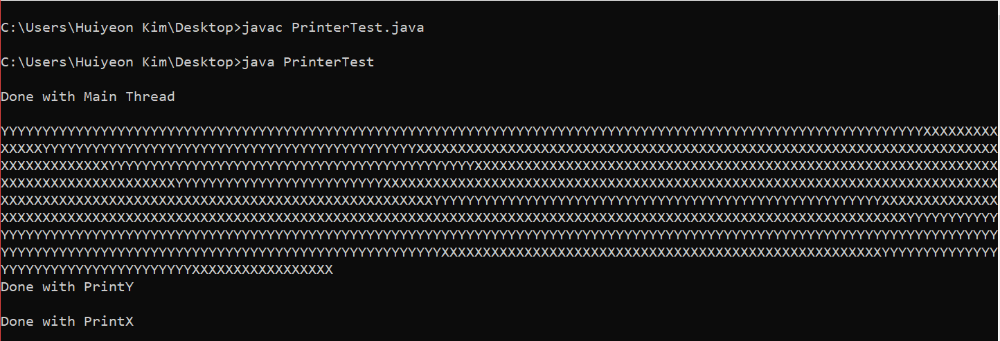
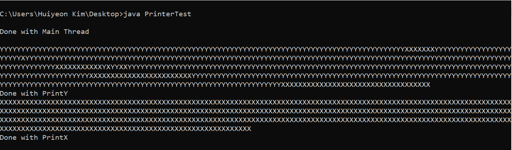

In this article, we will be taking a look at Concurrency Programming and Multi-threading, a critical programming concept for serious programmers who want to make their code faster.  I tried to make this programming concept as easy as possible so hopefully beginners can understand! This article will assume basic knowledge of Java.

 There are a few key concepts we will be going through in this article:

 1. What is Concurrency Programming?
 2. Processes and Threads
 3. Time Slicing
 4. Writing our first basic Multi-Threaded Code!

We've got lots to cover so lets get right into it!

## 1. What is Concurrency Programming?
Before we dive deep into this article, lets answer the first and the most important question of this article. What even is Concurrency Programming? 

Most computer users think running different programs at the same time as something a computer SHOULD do. It is taken for granted. People can download a file while watching YouTube or listen to music while reading my article &ast;*wink wink*&ast;. Even a single application is expected to do multiple things concurrently. Software which can handle more than 1 action at the same time is called *Concurrent Software.*

Now Java provides this functionality to programmers. Java has a built-in features for **concurrent execution** of its program. (*What?? So cooool right?*) 

<div class="md gif"> 


</div>

This means that we will be able to split our code into 2 or more executions to make different parts of our Java code to run **at the same time**. It is like allowing your code to Multi-task. This helps in making our program run with much faster execution time by making the **full use of our computer/laptop's computing capability**.  And the programming which allows us to do this is called **Concurrency Programming.**

Now this all sounds very cool and fun to implement but before we dive into programming, we need to understand what Threads and Processes are.

## 2. Processes and Threads

In Concurrent Programming, there are 2 units of execution: **Processes** and **Threads**. Although Concurrency Programming in Java deals more with Threads than Processes, it is important to know what they are and a few key differences between them.

**Process** can be viewed as a Program or Software which is executing some code. You can consider a Process as an application like Google Chrome or MS Excel. 

**Threads** are sort of like *sub-processes* within a Process. So a process can have MANY threads running to make the application complete. 

Lets take an example of MS Excel. Excel can have more than one thread doing independent tasks eg. A thread for Reading data from different Sheets and another for calculating the value for a formula we put in.

Simple right? 
<div class="md gif">


</div>

Now lets take a look at a few key differences between the two of them.

#### 1. Address Space
Each Process has their own Address Space assigned to them when a process is created while a Thread exists WITHIN the Address Space of the Process which owns it.

#### 2. Communication
Communication between two or more Process can be very expensive and limited but can be achieved by indirect methods such as Sharing a Database or talking to Sockets.
Java provides tools and methods for Inter-Thread Communication such as `notify()` and `notifyAll()`.

#### 3. Existence
This is probably the easiest difference between the two. Threads **cannot** exist without a Process and a Process requires **atleast one** Thread to run. Every Java Program has the `main()` method which acts as the *atleast one* Thread for the program.

There are more differences between the two but these are the key differences between Process and Threads. And now, once we go over the concept of Time Slicing, we can start Programming!

## 3. Time Slicing

Now we've taken a look at what Concurrency Programming is and what Threads/Processes are. Its time to get to know how Multi-Threaded Code (Code which creates multiple threads) actually executes!

Lets first consider a Computer with 1 CPU and an OS which allows Multi-Tasking. The CPU can handle only 1 process at a single point of time. (*Wait what? Then how does it Multi-Task?*) That is where Time Slicing comes into play. 
<div class="md gif">


</div>

The CPU's time is distributed between all the Concurrently-Running Processes. Lets say there are 2 processes, Process A and Process B running at the same time. At a point of time, the CPU will execute Process A and switch over to the Process B with or without completely finishing its previous process. So it gives a specific amount of time to each process which simulates the *Concurrently running Process*.

As mentioned before, Processes have many threads running. So when a CPU gives its time to Process A and Process A has Thread A and Thread B, just as only 1 process gets CPU time, only 1 Thread can get the CPU time at a single point of time and will switch over between Threads and Processes.

So Single CPU computers mimic a Concurrently Running Processes using Time Slicing, making Concurrency possible but the actual Parallelism of the process where 2 process are running at the same time, it would require more than 1 core in the machine.

Now that we learnt most of the important concepts, lets write our first Multi-threaded code and learn more!!

## 4. Writing our first basic Multi-Threaded Code!
As mentioned before, Java allows easy creation of multiple threads to allow Concurrency Programming. 

There are two main ways of writing Multi-Threaded code.

 1. Extending the **java.lang.Thread** class.
 2. Implementing the **java.lang.Runnable** interface.

### 1. Using the Thread class.

We can create a class that *extends* the Thread class. The created class should then override the `public void run()` method available in the Thread super class. 

For eg:
`class MultithreadDemo1 extends Thread { ... }`

Then we override the `run()` method,

```java
class MultithreadDemo1 extends Thread {
    @Override
    public void run()  {
        for(int i = 0; i < 100; i++) {
            System.out.print("Thread-1");
        }
        System.out.println("Finished Running MultithreadDemo1");
    }
}
```

The code which is meant to be executed in a separate thread from the `main()` thread should be written inside the `run()` method.

Then in the `main()` function, we create a new MultithreadDemo object and start the thread.

```java
public class MultithreadDemoTest  {
    public static void main(String[] args)  {
        Thread t1 = new MultithreadDemo1();
        
        // start()???
        t1.start();

        System.out.println("Done with Main Thread");
    }
}
```

Now the code snippet above will create a new Thread t1, and then starts the new thread! So when this code runs, there will be 2 threads running: `main()` thread and the `MultithreadDemo` thread. 

#### Thread.start() vs Thread.run()
Before we move on to the next method of writing Multi-threaded code, lets see the difference between `start()` and `run()`.

As mentioned before, the code which is meant to be executed in a new thread should be put inside the `run()` function. But when we actually want to create a new Thread and run it separately, we need to use the `start()` method. This is because calling the `run()` method would be considered a simple method call from another class. So the code inside the `run()` will run inside the `main()` Thread instead of creating a new Thread for it. On the other hand, the `start()` will actually create a new Thread and call the `run()` method in the new Thread it created, making the code multi-threaded.

Now that we understand what the difference is, lets see the next way of creating a Thread!

### 2. Using the Runnable interface.

This method of creating a Thread has one main difference from the first method. Instead of *extending* the Thread class, this method will *implement* a Runnable Interface. And just like the method above, all the code which is meant to run on a new thread should be implemented in the `run()` method.

Eg:

    class MultithreadDemo2 implements Runnable {
        @Override
        public void run()  {
            for(int i = 0; i < 100; i++) {
                System.out.print("Thread-2");
            }
            System.out.println("Finished Running MultithreadDemo2");
        }
    }


Then in the `main()` method, we create a new Thread object and **pass a MultithreadDemo2** as a parameter to this new object.

    public class MultithreadDemoTest  {
        public static void main(String[] args)  {
            Thread t1 = new Thread(new MultithreadDemo2());

            t1.start();
            
            System.out.println("Done with Main Thread");
        }
    }


This will result in the same output as the previous code. 

##### Note: As Java only allows a class to have one and only one *extends* but many *implements*, it is always better to use the second method. The second method provides flexibility for our class to be a sub class of another while being a Runnable Interface.

Now lets take a look at another example and inspect the output to see what exactly is going on. 

    public class PrinterTest {
	    public static void main(String[] args) {
	        Thread t1 = new Thread(new PrintX());
            Thread t2 = new Thread(new PrintY());
            t1.start();
            t2.start();
            System.out.println("\nDone with Main Thread\n");
	    }
    }
    
    class PrintX implements Runnable {
	    @Override
	    public void run() {
	        for(int i = 0;i < 500; i++) {
	            System.out.print("X");
	        }
	        System.out.println("\nDone with PrintX");
        }
    }
    
    class PrintY implements Runnable {
	    @Override
	    public void run() {
	        for(int i = 0;i < 500;i++) {
	            System.out.print("Y");
            }
	        System.out.println("\nDone with PrintY");
        }
    }

There are a few things going on in the code snippet above:

 1. PrintX and PrintY implements Runnable and prints "X" and "Y" 500 times respectively then prints "Done with Print_" when the method ends.
 2. PrinterTest class creates 2 Thread objects, passing PrinterX and PrinterY instances as paramters respectively
 3. PrinterTest class then starts the two Threads then goes on to print "Done with Main Thread".

From running this code, the below output is printed.



There are few things we can see:

 1. As you can see "Done with Main Thread" gets printed out first even though we started both the Threads as the CPU time (time slicing) was still with the Main Thread.
 2. Then the CPU time is given to PrintY Thread, printing out a few "Y"s. Then the CPU switches over to PrintX Thread for some time. 
 3. The CPU keeps switching between the two Threads until it was finished with PrintY then PrintX.

Pretty cool right? As I mentioned before, CPU time gets switched between the Threads (Main, PrintX, PrintY), simulating the Concurrency. One thing to note is that, the output will be different for everyone, depending on the machine and also will provide different outputs on another run as the Algorithm to time slice is not fixed to its program. It changes when you run it multiple times.

You can see the output below and try to understand how the CPU sliced its time in this run!




And that's it! We've gone through with the basics of Concurrency Programming. There is a lot more to cover so keep a look out for subsequent blogs!


