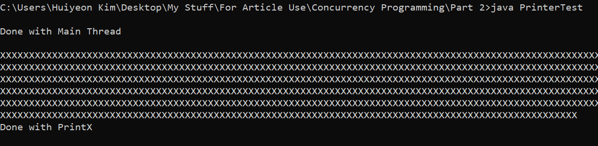
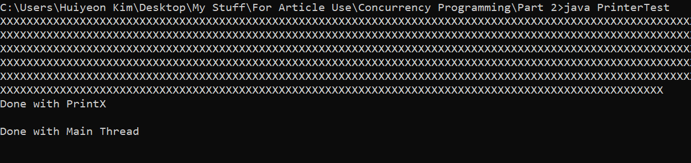
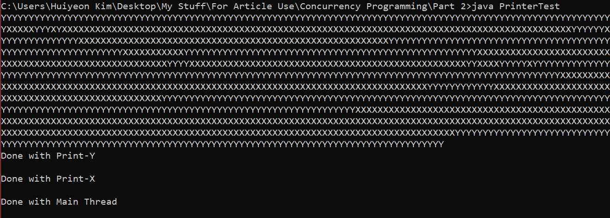

Now that we've gone through the Introduction to Concurrency programming in Java, let's take a deeper look into a important Thread function - "Join" which we can use! Also we will be taking a look at Java Thread State Diagram to understand how Java manages the different Threads.

So in this article, we will be going through:

1. Important Function - `Thread.join()` 
2. Java Thread State Diagrams

If you missed out on Part -1 of the series, [Click here to read it!](https://www.learningwars.com/concurrency-programming-part-1)

## 1. Important Function - Thread.join()
Java Thread API provides a lot of important and useful functions which developers and programmers can use to easily manipulate their threads. 
But in this article, we will only learn about the Thread.join() method!

### I. Thread.join()

> The `join` method allows one thread to wait for the completion of another.

The quote above is from [Java Tutorials on Join](https://docs.oracle.com/javase/tutorial/essential/concurrency/join.html). Now, while the definition provides a good explanation, let's see an example to further understand what it exactly means.

This code is the example we used in the previous article. I've added a few more lines of code to demonstrate how join works.

*PrinterTest.java*
```
public class PrinterTest {
    public static void main(String[] args) {
        Thread t1 = new Thread(new PrintX());
        t1.start();
        System.out.println("\nDone with Main Thread\n");
    }
}

class PrintX implements Runnable {
    @Override
    public void run() {
        for(int i = 0;i < 700; i++) {
            System.out.print("X");
        }
        System.out.println("\nDone with PrintX");
    }
}
```

This is a simple example of a multi-threaded program where the `main()` thread creates a new thread called `t1` which prints "X" 700 times. When we run the program we see:



1. The CPU time is with the `main()` thread until it finishes its execution, thus starting the `t1` thread then printing the output "Done with Main Thread".
2. Then the CPU time is switched over to `t1` thread then stays with that thread until the execution is over.

As you can see, the `main()` thread finishes its execution before it finishes the `t1` execution. But what if we want the `main()` thread to wait UNTIL the `t1` thread ends?? (HOW???)

<div class="md gif">

</div>

This is where the `join()` method comes into play. We tell our main thread to wait for the execution of `t1` to finish by calling the `join()` method on it. So we modify our `main()` to be:

*PrinterTest.java*
```
public class PrinterTest {
    public static void main(String[] args) {
        Thread t1 = new Thread(new PrintX());
        t1.start();
        try {
	        t1.join();
        } catch(InterruptedException e) {
            e.printStackTrace();        
        }
        System.out.println("\nDone with Main Thread\n");
    }
}

// Below is same as before
```
Before we run this code, we can clearly see that the `join()` method is surrounded with Try and Catch block. This is because `join()` method comes with a *Checked Exception* called `InterruptedException()` which I will not go into detail but you can refer to [this article](https://www.ibm.com/developerworks/java/library/j-jtp05236/index.html) to find more information about it. For now, we will understand it as an Exception thrown when a Thread gets interrupted, probably by `Thread.interrupt()` function.

Now when we run this, we get this output.



As the code runs, the main thread will create a new `t1` thread and start it by calling the start function. Then, DUE to the `join()` method called on `t1` thread, we can see that all the "X"'s get printed out first, then we see the "Done with Main Thread" output.  With the `join()` method, we can now stop the `main()` thread until the other thread ends first!

<div class="md gif">


</div>

Now let's try using the `join()` method on more than 1 thread to consolidate our learning!

*PrinterTest.java*
```
public class PrinterTest {
    public static void main(String[] args) {
        Thread t1 = new Thread(new PrintSomething("X"));
        Thread t1 = new Thread(new PrintSomething("Y"));
        t1.start();
        t2.start();
        try {
	    t1.join();
	    t2.join();
        } catch(InterruptedException e) {
            e.printStackTrace();        
        }
        System.out.println("\nDone with Main Thread\n");
    }
}

class PrintSomething implements Runnable  {
    private String toPrint;
    public PrintSomething(String toPrint)  {
        this.toPrint = toPrint;
    }

    @Override
    public void run() {
        for(int i = 0; i < 700; i++)  {
            System.out.print(toPrint);
        }
        System.out.println("\nDone with Print-"+toPrint);
    }
}
```

We added a new class called PrintSomething with a private instance variable of the string we are printing out. We also modified the `main()` method to create 2 objects of the PrintSomething class, call the `Thread.start()` function and `Thread.join()` function. Lets see what happens when we run this code.



As you can see, the CPU time is juggling between `t1` and `t2` until it finishes printing "Y" then "X" then the `main()` thread ends. So the `main()` thread waits for the 2 threads to end due to the `join()` method. 

One of the things which I was confused about was whether which thread you "join" first matters. When I was first learning about this, I couldn't get my head around how "join" works. I thought if you put `t1.join()` before `t2.join()`, `t2` will stop its execution until `t1` was done, which obviously is not the case. Since we used the `start()` method on both the threads, even if we `join()` `t1` first, the `t2` will still be running in the shadows. It doesn't matter which thread we use `.join()` on. This also explains the reason why the second thread can end before the first thread as the it does not matter.

I hope this was sufficient enough for everyone to understand the `join()` method!

<div class="md gif">


</div>
Now we'll go on to the Java Thread State Diagram!


## 2. Java Thread State Diagram

Look at the image below.


Image from: [Core Java Vol 1, 9th Edition](https://www.google.com/search?q=Core+Java+Vol+1%2C+9th+Edition%2C+Horstmann%2C+Cay+S.+%26+Cornell%2C+Gary_2013&oq=Core+Java+Vol+1%2C+9th+Edition%2C+Horstmann%2C+Cay+S.+%26+Cornell%2C+Gary_2013&aqs=chrome..69i57.383j0j7&sourceid=chrome&ie=UTF-8).

This image describes the different states of a Thread, sort of like a life-cycle of a thread.

### A. New
The *new* state describes a step in the life-cycle where the Thread has been created but not started yet. When a thread lies in the *new* state, the thread has not been started.

`Thread t1 = new Thread(new RunnnableClass());` 

At this point, `t1` will be at the *new* state.

### B. Runnable
A thread will be in the *runnable* state when the thread has been started. It may be running or may be ready to run. This is because, even if the `thread.start()` method has been called, the CPU time might be with another thread. This is when a thread is in a *runnable* state but just *ready* to run. If the CPU time is with the thread, then the thread is in *runnable* state and *running*.

### C. Waiting
A thread will be in the *waiting* state when a thread is sent to the *waiting* state by calling the `Thread.wait()`. The thread will state in this state until there is a `notify()` or `notifyAll()` from the other threads to this thread. Also, the `main()` thread goes into *waiting* state when it calls the `join()` method on other threads. It waits until the other states finish their operation.

### D. Blocked

A thread will be in *blocked* state for many different reasons. One of the reason it goes to *blocked* could be if the thread is waiting for a I/O input from the user or it is trying to access a *protected* method which is already being accessed by another thread. (This is called Locking, which I will go through in the next article). Once the thread is in this state, it stays this way until the thread scheduler moves this thread to the *runnable* state again.

### E. Timed Waiting
A thread will be in the *timed waiting* state when the thread calls the `sleep()` method to put the thread to sleep. It will return to *runnable* when the thread waits for the whole duration.

### F. Terminated
A thread terminates for one of two reasons. 
1. The code finished Executing
2. There was some error such as unhandled exception.

These are all the Thread States. It might not be used for programming much but it is important to understand the different states to know how to debug if a bug is found!

And that's it! We've gone through with the `Thread.join()` method and the Thread State Diagrams. 

Next article, I will go through Race Conditions in Multi-threading which is one of the most important concepts to know!