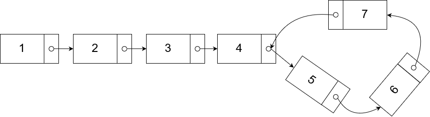
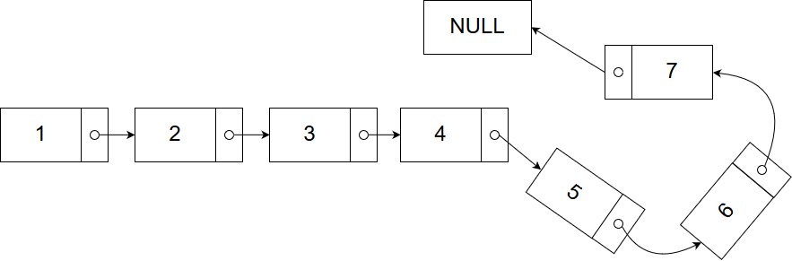

Welcome back to Learnwars! Today I will be going through a classic interview question (I personally got asked this question from a company!!) and how we can go about solving the question using Floyd's Tortoise and Hare algorithm. It was one of those algorithms where when you get to know about it, you just sit there and think "How can it be so simple and why didnt I think of this before??"

So the question is **Given a LinkedList, Detect if it contains a Cycle.** A simple question. We just need to find if there is a cycle in a linkedlist. (*For those who are not well-versed with what a linkedlist is, you can read about it [here.](https://www.geeksforgeeks.org/data-structures/linked-list/)*)

Lets take a look at some sample inputs and outputs to further understand what the question means!

*Input 1:*

*Output 1:* true

This is because we can see that the Node with value 7 connects back to the Node with value 4.

*Input 2:*

*Output 2:* False

This is because the last node links to a *null*, which denotes that the linkedlist has an end.

Now lets get hackinggg!!

## Method 1 - Using Hashing
Of course. The first method is to use Hashing. The first thing we can do is to keep another data structure (HashSet) to store the Nodes which are already visited! Then we can just loop over the Linked List once and see if the hashset contains the current element!

Lets code this out.

    // The Node class. "next" is the pointer to the next Node
    
    public class Node {
        int val;
        Node next;
        Node(int val) { this.val = val; next = null}
    }

    public class CycleDetection {
        public boolean detectCycle(Node head) {
            Set<Node> set = new HashSet<>();
            
            while(head != null) {
                if(set.contains(head)) {
                    return true;
                }
                set.add(head);
                head = head.next;
            }
            
            return false;
        }
    }

As you can see, it is a simple and elegant solution to this problem. We keep a HashSet of Nodes and if the set already `contains` the node, we will return `true` regardless. Otherwise we would add the current head to the set and move the pointer to the next item! If the loop ends, it means that there were no cycles detected and we can just return `false`.

Simple right? And its pretty fast too! With time complexity of O(n) and space of O(n), we can just all be satisfied and leave the interview with hopes of getting in. Haha jokes. Of course not. We can do better than this, enter Floyd's algorithm!!

 

## Floyd's Tortoise and Hare Algorithm.

This algorithm is honestly very simple. All we need to do is keep 2 pointers to the Head Node of the linked list. 1 being the hare and 1 being the tortoise. The hare will move by 2 pointers while the tortoise moves by 1. And the cool part is that, IF there is a cycle in the linked list, the two pointers will eventually meet (Note that it WONT meet at the point where the cycle is formed. It will meet somewhere in the linked list). If there is NO cycle, then the Hare pointer will move to the null position which is the end of the list! Lets check this out on code.

    // The Node class. "next" is the pointer to the next Node
    
    public class Node {
        int val;
        Node next;
        Node(int val) { this.val = val; next = null}
    }
    
    public class CycleDetection {
        public boolean detectCycle(Node head) {
            if(head == null) return false;
            Node hare = head;
            Node tortoise = head;
            
            while(hare != null && hare.next != null) {
                hare = hare.next.next;
                tortoise = tortoise.next;
                
                if(hare == tortoise) {
                    return true;
                }
            }
            
            return false;
        }
    }

Simple simple. As I mentioned, we can keep 2 pointers, the hare moving twice the speed of the tortoise and if hare and tortoise is the same, we return true. If Hare is null, then we return false! 

Of course. This method is still O(n) but in real time, it is much faster than the hashing method. If there is no cycle in the list, the hare will reach the end of the list twice as fast as the first hashing method as it keeps by 2! Also it has a space complexity of O(1) which is better than the hashing method too. 

Yay new algorithm down!! Its pretty simple to remember. All we need to remember is that there is a Hare and a Tortoise and that the Hare moves twice as fast as the Tortoise. Also, this algorithm can be used for other interview question such as **Finding the Node where the Intersection occur, if there is a cycle in the Linked List.** Lets take a look at how we can solve this.

### Bonus Section: Finding the Cycle Start node.
Okay. Special bonus section for all of you. This is where things get really cool. As mentioned before, the hare and tortoise detects if there is a cycle in the linked list and it **doesn't necessarily mean** that the two pointers will meet at the point where the cycle starts. How can we go about solving this then?

 We can use the same method as above, the Hare and Tortoise algorithm to detect if there is a loop in the Linked List. When there IS a cycle, it is **guaranteed** that the two pointers meet at the **mid** point of the starting node of the linkedlist. So all we need to do is the move one of the pointers back to the head of the linked list, then move the two pointers at the same speed. (1 will start from the head and 1 from the first meeting point). Then when the two pointers meet again, that is the Cycle Start Node. 

Again, since the distance from the first meeting point to the cycle start node IS THE SAME as the distance from the head of linked list to the cycle start node, by moving at the same pace, we can find the cycle start node!!! Its pretty super cool.

You guys can try to do this yourselves, its pretty simple. Thank you for reading!