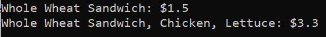

---
path: '/design-patterns-java-decorator-pattern'
title: 'Design Patterns in Java - Decorator Pattern'
author: 'Huiyeon Kim'
date: '2019-02-26'
cover_image: "./background.jpg"
---
In this article, I would be doing my best to go through the Decorator pattern, what it is, how it is used and why it is good!
Again, shout out to one of the best books I've read - [Head First Design Patterns](http://shop.oreilly.com/product/9780596007126.do) - for easy explanation of the topics.

## Decorator Pattern
Lets look at the definition of Decorator Pattern is:

> Attach additional responsibilities to an object dynamically. Decorators provide a flexible alternative to extending functionality.

Just like we did for the Strategy pattern, lets try and understand what the Decorator Pattern is using an example.

Lets take a look at a Sandwich Shop (Han's Sandwich Shop). Han's Sandwich shop provides, obviously, sandwiches. With different types of bread, a customer can choose a type of bread then add on toppings to the bread to make their dream sandwich. The price of the sandwich is determined by what bread and toppings they decide to choose. Currently, Han's sandwich shop provides 4 different types of Bread (Parmesan, Whole Wheat, Multigrain and Italian) and 4 different toppings (Chicken, Lettuce, Onion, Tomato) (Its a small shop). 

## Design 1: Inheritance
We can have an abstract super class of Sandwich which has an abstract method to return the cost of the Sandwich.

    public abstract class Sandwich {
        String description;
        
        public String getDescription() {
            return description;
        }
        
        public abstract double cost();
    }

Then we can construct the sub classes of sandwich with each of its cost implemented.

    public class WholeWheat extends Sandwich {
        public WholeWheat() {
            description = "Whole Wheat Sandwich";
        }
        
        public double cost() {
            return 1.5;
        }
    }
    
    public class Multigrain extends Sandwich {
        public Multigrain() {
            description = "Multigrain Sandwich";
        }
        
        public double cost() {
            return 1.8;
        }
    }
    .
    .
    .  // And so on.

This way, we could possibly have many different types of sandwiches and the price of each item. But the problem comes when we want to add toppings to these sandwiches. One way is to create that many more classes such as WholeWheatWithChicken, WholeWheatWithChickenLettuce .. etc. Which of course is a terrible design as we would need 4 * 2^4 number of classes. And if we want to increase the price of any one of the toppings/bread, we need to make the changes in a lot of classes.

So we should take another approach.

## Design 2: Instance Variables
We could add the toppings a instance variables in the Sandwich class and add it in during run time. It would definitely be better than the previous design where would have a Class Explosion. And also we would be able to get and set the price of the toppings in an easier manner.

    public class Sandwich {
        // Description same as before
        double chickenCost = 2;
        double lettuceCost = 1.1;
        double onionCost = 1;
        double tomatoCost = 1;
        
        // Add getter/setter for all toppings
        // Add has<Topping> methods for all toppings
        
        public double cost() {
            double c = 0;
            if(hasChicken()) {
                c += chickenCost;
            } else if(hasLettuce()) {
                c += lettuceCost;
            } else if(hasOnion()) {
                c += onionCost;
            } else if(hasTomato()) {
                c += tomatoCost;
            }
            return c;
        }
    }

Then we can tweak all the subclasses to be:

    public class WholeWheat extends Sandwich {
        public WholeWheat() {
            description = "Whole Wheat Sandwich";
        }
        
        //Difference is here
        public double cost() {
            return 1.5 + super.cost();
        }
    }
    
    public class Multigrain extends Sandwich {
        public Multigrain() {
            description = "Multigrain Sandwich";
        }
        
        // Difference is here
        public double cost() {
            return 1.8;
        }
    }
    .
    .
    .  // And so on.

This way we can reduce the number of classes while allowing the use to add toppings of his choice. But again there are downsides to this:

1. If we want to add new Toppings such as Olives etc, we have to change the sandwich class.
2. We cannot have double onion or triple tomato if a customer loves that specific topping
3. EVERY single sub class of Sandwich will have the toppings as an instance variable which may not make sense if we have some new type of sandwich.

## Design 3: Decorator Design
In this design, we compose the classes in such a way that we can *wrap* the main class (Sandwich) with Decorator Classes such as Toppings. One of the main points of the Decorator pattern is the fact that when we *wrap* the main class using the Decorator, the type of that object still remains as the Main (Sandwich class). 

We can bring the Sandwich class back to its original state:

    public abstract class Sandwich {
        String description;
        
        public String getDescription() {
            return description;
        }
        
        public abstract double cost();
    }

Then the All the main sub classes (the types of bread) remain the same as the original.

    public class WholeWheat extends Sandwich {
        public WholeWheat() {
            description = "Whole Wheat Sandwich";
        }
        
        public double cost() {
            return 1.5;
        }
    }
    
    public class Multigrain extends Sandwich {
        public Multigrain() {
            description = "Multigrain Sandwich";
        }
        
        public double cost() {
            return 1.8;
        }
    }
    .
    .
    .  // And so on.

All is good and fine till now, it is the same as the first method. But from now on is where the magic happens. First we create a Sub Class of Sandwich which would be used to represent all the toppings available to Han's sandwich shop.

    public abstract class ToppingDecorator extends Sandwich{
        public abstract String getDescription();
    }

We notice a few things here. 

1. The ToppingDecorator extends Sandwich as a super class, making the ToppingDecorator an instance of Sandwich. The purpose of using inheritance here is not to inherit the Sandwich's properties/methods but to make our ToppingDecorator a Sandwich.
2. We made the getDescription method  (Which is technically a method in Sandwich) an abstract method as each of the toppings would re implement this.
3. The cost() method has been left out as again, it would be re-implemented by each Topping.

Now lets code the Toppings!

    public class Chicken extends ToppingDecorator {
        Sandwich sandwich;
        public Chicken(Sandwich sandwich) {
            this.sandwich = sandwich;
        }
        
        public String getDescription() {
            return sandwich.getDescription() + ", Chicken";
        }
        
        public double cost() {
            return sandwich.cost() + 1;
        }
    }
    
    public class Lettuce extends ToppingDecorator {
        Sandwich sandwich;
        public Lettuce(Sandwich sandwich) {
            this.sandwich = sandwich;
        }
        
        public String getDescription() {
            return sandwich.getDescription() + ", Lettuce";
        }
        
        public double cost() {
            return sandwich.cost() + 0.8;
        }
    }
    .
    .
    . //And so on

Theres quite a bit going on here so lets try and dissect it.

1. Each Topping keeps an instance variable of Sandwich, which technically is a reference to the object it is decorating.
2. The getDescription() method returns a concatenation of the getDescription of the object it is decorating and the information about itself. This way if we decorate the main object twice, the description of the object will have the two decorating class' information concatenated to it.
3. The cost() method also follows a similar structure as the getDescription(). The cost() method will return the sum of the object it is decorating and the price of that specific topping.

Now lets create a main class for the sandwich shop!

    public class HanSandwich{
        public static void main(String[] args) {
            Sandwich sandwich = new WholeWheat();
            System.out.println(sandwich.getDescription()  +  
                  ": $"  +  sandwich.cost());
            
            sandwich = new Chicken(sandwich);
            sandwich = new Lettuce(sandwich);
            
            System.out.println(sandwich.getDescription()  +  
                  ": $"  +  sandwich.cost());
        }
    }

Now when we run this,  we can see the following output.

This way you can see that when we decorate or wrap the first Sandwich object, we can dynamically change the Description and the cost of the sandwich only at runtime. This method provides flexibility of adding multiple or no topping to the Sandwich. 

One main benefit it provides is an very important Design Principle.

> Classes should be open for extension but closed for modification

This design pattern technically says that a program should be dynamic enough to be able to add extensions (New Toppings) without the modification of the classes which already exists. In our Design 3, we can add new Toppings by creating a new class which extends the ToppingDecorator and we wouldnt have to touch our previous code at all.

This pattern is very widely used in Java I/O which is why there are 100s of IO classes available in Java. Technically, adding a new I/O class is very simple, we just need to extend the ***FilterInputStream*** class and override the *read()* method of it!

I hope this was easy enough to understand for everyone and see you in the next article.
